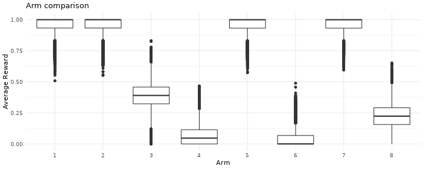
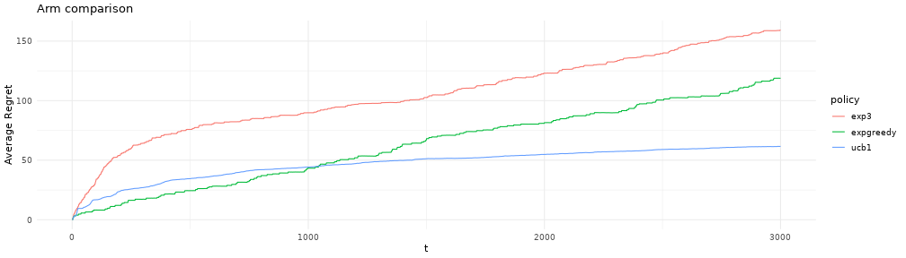

[Obandit](http://freux.fr/oss/obandit.html)-0.3.4 experimental validation.
==========================================================================

The source for this experimental validation can be found
[here](source.tgz)

::: {#cb1 .sourceCode}
``` {.sourceCode .r}
theme_set(theme_minimal())
scale_colour_continuous <- function(...)
       scale_colour_brewer(palette="Pastel1", ...)
scale_fill_continuous <- function(...)
       scale_fill_brewer(palette="Pastel1",...)
k=(ncol(data)-4)
setnames(data, "arm", "played")
data$played=data$played+1
data$best=as.numeric(apply(data,1,max))
```
:::

    ## Warning: NAs introduced by coercion

::: {#cb3 .sourceCode}
``` {.sourceCode .r}
data$played_loss=as.numeric(apply(data,1,function (x) unlist(x[as.integer(x["played"])])))
data$best_hindsight=data[,as.numeric(which.max(lapply(data[,1:k],mean)))]
```
:::

::: {#cb4 .sourceCode}
``` {.sourceCode .r}
reduce_t <- function (d) {
  data.frame(
            inst_avgregret=mean(-d$played_loss+d$best_hindsight),
            t=d$t[1]
            )
}
reduce_experiment <- function (d) {
  data.frame(
            regret_t=cumsum(-d$played_loss+d$best_hindsight),
            t=d$t
            )
}
reduce_t2 <- function (d) {
  data.frame(
            avgregret=mean(d$regret_t),
            t=d$t[1]
            )
}
data_reduced=ddply(data,c("t","policy"),reduce_t)
data_reduced$avgregret=cumsum(data_reduced$inst_avgregret)
data_reduced=ddply(data,c("experiment","policy"),reduce_experiment)
data_reduced=ddply(data_reduced,c("t","policy"),reduce_t2)
```
:::

Gaussian thresholded arms for 8 arms and 9000 rounds, experimental sample size 30.
==================================================================================

Basic arm rewards:

::: {#cb5 .sourceCode}
``` {.sourceCode .r}
data_mutated = data %>% gather("arm","loss",1:k)
ggplot(data_mutated,aes(arm,loss,group=factor(arm)))+
geom_boxplot() +
labs(title ="Arm comparison", x = "Arm", y = "Average Reward", fill="Arm") +
scale_x_discrete()
```
:::



Full summary of the data:

::: {#cb6 .sourceCode}
``` {.sourceCode .r}
print(summary(data))
```
:::

    ##        1                2                3                4          
    ##  Min.   :0.5081   Min.   :0.5517   Min.   :0.0000   Min.   :0.00000  
    ##  1st Qu.:0.9326   1st Qu.:0.9328   1st Qu.:0.3228   1st Qu.:0.00000  
    ##  Median :0.9999   Median :1.0000   Median :0.3902   Median :0.04671  
    ##  Mean   :0.9600   Mean   :0.9601   Mean   :0.3902   Mean   :0.06752  
    ##  3rd Qu.:1.0000   3rd Qu.:1.0000   3rd Qu.:0.4579   3rd Qu.:0.11432  
    ##  Max.   :1.0000   Max.   :1.0000   Max.   :0.8310   Max.   :0.46602  
    ##                                                                      
    ##        5                6                 7                8         
    ##  Min.   :0.5730   Min.   :0.00000   Min.   :0.5949   Min.   :0.0000  
    ##  1st Qu.:0.9318   1st Qu.:0.00000   1st Qu.:0.9317   1st Qu.:0.1563  
    ##  Median :0.9996   Median :0.00000   Median :0.9998   Median :0.2235  
    ##  Mean   :0.9598   Mean   :0.04004   Mean   :0.9598   Mean   :0.2241  
    ##  3rd Qu.:1.0000   3rd Qu.:0.06784   3rd Qu.:1.0000   3rd Qu.:0.2911  
    ##  Max.   :1.0000   Max.   :0.48868   Max.   :1.0000   Max.   :0.6513  
    ##                                                                      
    ##        t            experiment       played         policy         
    ##  Min.   :   1.0   Min.   : 1.0   Min.   :1.000   Length:270000     
    ##  1st Qu.: 750.8   1st Qu.: 8.0   1st Qu.:2.000   Class :character  
    ##  Median :1500.5   Median :15.5   Median :5.000   Mode  :character  
    ##  Mean   :1500.5   Mean   :15.5   Mean   :4.223                     
    ##  3rd Qu.:2250.2   3rd Qu.:23.0   3rd Qu.:7.000                     
    ##  Max.   :3000.0   Max.   :30.0   Max.   :8.000                     
    ##                                                                    
    ##       best         played_loss     best_hindsight  
    ##  Min.   : NA      Min.   :0.0000   Min.   :0.5517  
    ##  1st Qu.: NA      1st Qu.:0.9196   1st Qu.:0.9328  
    ##  Median : NA      Median :0.9935   Median :1.0000  
    ##  Mean   :NaN      Mean   :0.9224   Mean   :0.9601  
    ##  3rd Qu.: NA      3rd Qu.:1.0000   3rd Qu.:1.0000  
    ##  Max.   : NA      Max.   :1.0000   Max.   :1.0000  
    ##  NA's   :270000

### Performance of various algorithms.

In terms of regret to best arm in hindsight, using exp3, ucb1 and
fixed-exploration epsilon-greedy:

::: {#cb8 .sourceCode}
``` {.sourceCode .r}
  ggplot(data_reduced,aes(t,avgregret,color=policy))+
  geom_line() +
  labs(title ="Arm comparison", x = "t", y = "Average Regret", fill="Arm") +
  scale_x_continuous()
```
:::


